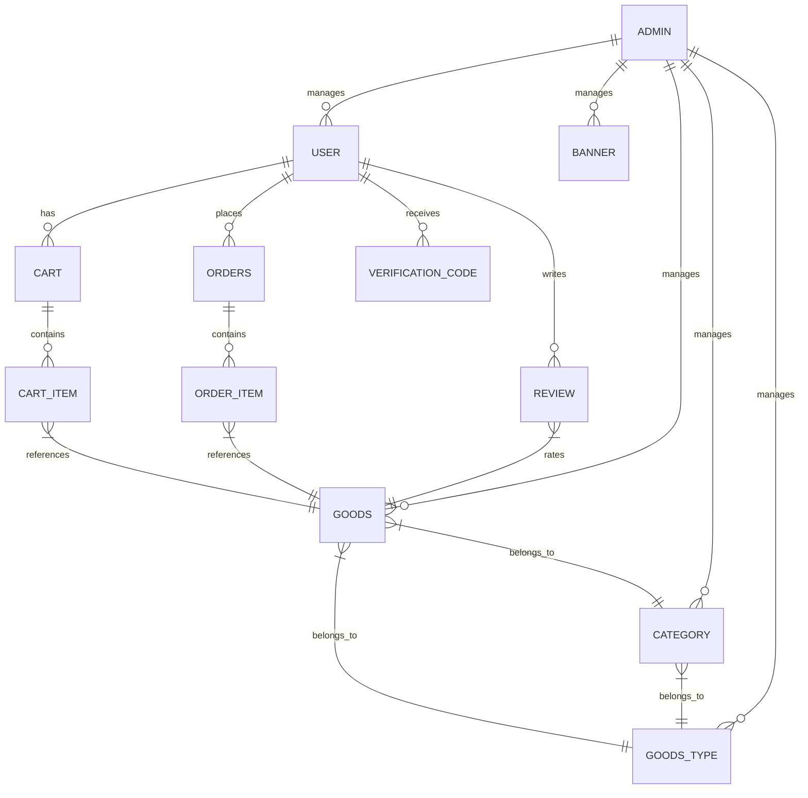

# 项目使用文档

## 1. 数据库结构

### 1.1 实体关系图(ERD)



### 1.2 表结构详情

#### 1.2.1 管理员表 (admin)

| 字段名 | 数据类型 | 约束 | 描述 |
|--------|----------|------|------|
| id | int | NOT NULL AUTO_INCREMENT PRIMARY KEY | 自增ID |
| username | varchar(50) | NOT NULL UNIQUE | 管理员账号 |
| password | varchar(255) | NOT NULL | 加密后的密码 |
| create_at | datetime | NOT NULL | 创建时间 |
| last_login | datetime | NULL | 最后登录时间 |
| user | varchar(255) | NULL | 使用人 |
| type | tinyint(1) | NOT NULL | 分类 |

#### 1.2.2 广告表 (banner)

| 字段名 | 数据类型 | 约束 | 描述 |
|--------|----------|------|------|
| bid | int | NOT NULL AUTO_INCREMENT PRIMARY KEY | 自增ID |
| image | varchar(500) | NOT NULL | 广告图片URL |
| jump | varchar(500) | NULL | 广告跳转链接 |
| sort | int | NOT NULL | 排序序号（升序排列） |
| status | tinyint(1) | NOT NULL | 状态 (1启用, 0禁用) |
| created_at | datetime | NOT NULL | 创建时间 |

#### 1.2.3 购物车表 (cart)

| 字段名 | 数据类型 | 约束 | 描述 |
|--------|----------|------|------|
| cart_id | int | NOT NULL AUTO_INCREMENT PRIMARY KEY | 购物车id |
| user_id | int | NOT NULL | 用户id |
| created_at | datetime | NULL DEFAULT CURRENT_TIMESTAMP | 创建时间 |

#### 1.2.4 购物车条目表 (cart_item)

| 字段名 | 数据类型 | 约束 | 描述 |
|--------|----------|------|------|
| item_id | int | NOT NULL AUTO_INCREMENT PRIMARY KEY | 购物车条目ID |
| cart_id | int | NULL | 购物车id |
| gid | int | NULL | 商品id |
| title | varchar(255) | NULL | 商品名 |
| price | decimal(10, 2) | NULL | 单价 |
| quantity | int | NULL | 数量 |

#### 1.2.5 商品分类表 (category)

| 字段名 | 数据类型 | 约束 | 描述 |
|--------|----------|------|------|
| cid | int | NOT NULL AUTO_INCREMENT PRIMARY KEY | 二级分类id |
| cname | varchar(50) | NOT NULL | 二级分类 |
| tid | int | NOT NULL | 一级分类id |

#### 1.2.6 商品表 (goods)

| 字段名 | 数据类型 | 约束 | 描述 |
|--------|----------|------|------|
| gid | int | NOT NULL AUTO_INCREMENT PRIMARY KEY | 自增ID |
| tid | int | NULL | 一级分类，goodstype |
| cid | int | NULL | 二级分类，category |
| title | varchar(255) | NOT NULL | 商品标题 |
| image | varchar(500) | NULL | 商品图片封面 |
| price | decimal(10, 2) | NOT NULL | 价格 |
| stock | int | NOT NULL | 库存量 |
| is_shelved | tinyint(1) UNSIGNED ZEROFILL | NOT NULL | 上架状态（1上架/0下架） |
| details | text | NULL | 商品详情 |
| rating | float | NULL | 评分（1-5） |
| created_at | datetime | NULL | 创建时间 |

#### 1.2.7 商品类型表 (goods_type)

| 字段名 | 数据类型 | 约束 | 描述 |
|--------|----------|------|------|
| tid | int | NOT NULL AUTO_INCREMENT PRIMARY KEY | 一级分类id |
| tname | varchar(255) | NULL | 一级分类名 |

#### 1.2.8 订单条目表 (order_item)

| 字段名 | 数据类型 | 约束 | 描述 |
|--------|----------|------|------|
| item_id | int | NOT NULL AUTO_INCREMENT PRIMARY KEY | itemid |
| order_id | int | NULL | 订单id |
| gid | int | NULL | 商品id |
| title | varchar(255) | NULL | 标题 |
| quantity | int | NULL | 商品数量 |
| price | decimal(10, 2) | NULL | 单价 |

#### 1.2.9 订单表 (orders)

| 字段名 | 数据类型 | 约束 | 描述 |
|--------|----------|------|------|
| order_id | int | NOT NULL AUTO_INCREMENT PRIMARY KEY | 自增订单ID |
| user_id | int | NOT NULL | 消费者ID |
| pay_num | varchar(255) | NULL | 流水号 |
| total_amount | decimal(10, 2) | NULL | 订单总金额 |
| payment_method | varchar(50) | NULL | 支付方式（alipay） |
| payment_status | int | NULL | 支付状态（0未支付，1已支付，2支付失败） |
| pay_time | datetime | NULL | 支付时间 |
| order_status | int | NULL | 订单状态（0取消，1待发货，2已发货，3已签收） |
| order_time | datetime | NULL | 下单时间 |
| expire_time | datetime | NULL | 过期时间 |

#### 1.2.10 评论表 (review)

| 字段名 | 数据类型 | 约束 | 描述 |
|--------|----------|------|------|
| review_id | int | NOT NULL AUTO_INCREMENT PRIMARY KEY | 评论ID |
| uid | int | NOT NULL | 用户id |
| gid | int | NOT NULL | 商品id |
| rating | int | NULL | 评分 |
| comment | text | NULL | 评论内容 |
| status | tinyint(1) | NULL | 评论状态 |
| created_at | datetime | NULL | 创建时间 |

#### 1.2.11 用户表 (user)

| 字段名 | 数据类型 | 约束 | 描述 |
|--------|----------|------|------|
| uid | int | NOT NULL AUTO_INCREMENT PRIMARY KEY | 自增用户ID |
| username | varchar(50) | NOT NULL UNIQUE | 用户名 |
| password | varchar(255) | NOT NULL | 加密后的密码 |
| avatar | varchar(255) | NULL | 头像URL |
| email | varchar(100) | NOT NULL UNIQUE | 邮箱 |
| phone | varchar(11) | NULL | 手机号 |
| address | varchar(255) | NULL | 收货地址 |
| last | datetime | NULL | 最后登录时间 |
| created | datetime | NOT NULL | 创建时间 |
| role | varchar(20) | NOT NULL DEFAULT 'USER' | 用户角色 |

#### 1.2.12 验证码表 (verification_code)

| 字段名 | 数据类型 | 约束 | 描述 |
|--------|----------|------|------|
| id | bigint | NOT NULL AUTO_INCREMENT PRIMARY KEY | id |
| email | varchar(255) | NOT NULL | 接收邮箱 |
| code | varchar(255) | NOT NULL | 验证码 |
| created_at | datetime | NOT NULL | 创建时间 |
| expires_at | datetime | NOT NULL | 过期时间 |

### 1.3 表关系说明

- **用户与购物车**：一对多关系，一个用户拥有一个购物车
- **购物车与购物车条目**：一对多关系，一个购物车包含多个购物车条目
- **购物车条目与商品**：一对一关系，每个购物车条目对应一个商品
- **用户与订单**：一对多关系，一个用户可以创建多个订单
- **订单与订单条目**：一对多关系，一个订单包含多个订单条目
- **订单条目与商品**：一对一关系，每个订单条目对应一个商品
- **用户与评论**：一对多关系，一个用户可以发表多条评论
- **评论与商品**：一对多关系，一个商品可以有多条评论
- **商品与商品类型**：多对一关系，多个商品属于一个商品类型
- **商品与分类**：多对一关系，多个商品属于一个分类
- **分类与商品类型**：多对一关系，多个分类属于一个商品类型
- **管理员与广告**：一对多关系，一个管理员可以管理多个广告
- **管理员与商品**：一对多关系，一个管理员可以管理多个商品
- **管理员与分类**：一对多关系，一个管理员可以管理多个分类
- **管理员与商品类型**：一对多关系，一个管理员可以管理多个商品类型
- **管理员与用户**：一对多关系，一个管理员可以管理多个用户
- **用户与验证码**：一对多关系，一个用户可以接收多个验证码

## 2. API接口文档

### 2.1 管理员API

#### 2.1.1 管理员登录
- **URL**：`/admin/login`
- **方法**：`POST`
- **请求体**：
  ```json
  {
    "username": "admin",
    "password": "password"
  }
  ```
- **响应**：JWT令牌
- **认证**：无需认证

#### 2.1.2 获取当前管理员
- **URL**：`/admin/current`
- **方法**：`GET`
- **请求头**：`Authorization: Bearer <token>`
- **响应**：管理员信息
- **认证**：需要管理员JWT令牌

#### 2.1.3 管理员注册
- **URL**：`/admin/register`
- **方法**：`POST`
- **请求体**：
  ```json
  {
    "username": "newadmin",
    "password": "password",
    "user": "使用人",
    "type": 1
  }
  ```
- **响应**：创建的管理员信息
- **认证**：需要管理员JWT令牌

### 2.2 用户API

#### 2.2.1 用户注册
- **URL**：`/user/register`
- **方法**：`POST`
- **请求体**：
  ```json
  {
    "username": "user1",
    "password": "password",
    "email": "user1@example.com"
  }
  ```
- **响应**：注册成功的用户信息
- **认证**：无需认证

#### 2.2.2 用户登录
- **URL**：`/user/login`
- **方法**：`POST`
- **请求体**：
  ```json
  {
    "username": "user1",
    "password": "password"
  }
  ```
- **响应**：包含JWT令牌和用户信息
- **认证**：无需认证

#### 2.2.3 验证码登录
- **URL**：`/user/loginWithVerificationCode/{email}`
- **方法**：`POST`
- **请求体**：
  ```json
  {
    "verificationCode": "123456"
  }
  ```
- **响应**：包含JWT令牌和用户信息
- **认证**：无需认证

#### 2.2.4 上传头像
- **URL**：`/user/uploadAvatar/{uid}`
- **方法**：`POST`
- **请求参数**：`file`（MultipartFile）
- **响应**：头像URL
- **认证**：需要用户JWT令牌

#### 2.2.5 发送验证码
- **URL**：`/user/sendVerificationCode/{email}`
- **方法**：`POST`
- **响应**：验证码发送成功
- **认证**：无需认证

#### 2.2.6 修改密码（通过旧密码）
- **URL**：`/user/updatePasswordWithOld`
- **方法**：`PUT`
- **请求体**：
  ```json
  {
    "uid": 10000,
    "oldPassword": "oldpass",
    "newPassword": "newpass"
  }
  ```
- **响应**：修改结果
- **认证**：需要用户JWT令牌

### 2.3 商品API

#### 2.3.1 获取所有商品
- **URL**：`/goods/getAllGoods`
- **方法**：`GET`
- **请求参数**：
  - `pageNum`：页码，默认1
  - `pageSize`：每页数量，默认20
- **响应**：分页商品列表
- **认证**：无需认证

#### 2.3.2 获取商品详情
- **URL**：`/goods/getGoodsById/{gid}`
- **方法**：`GET`
- **响应**：商品详情
- **认证**：无需认证

#### 2.3.3 按名称搜索商品
- **URL**：`/goods/getGoodsByName`
- **方法**：`GET`
- **请求参数**：
  - `name`：商品名称关键词
  - `pageNum`：页码，默认1
  - `pageSize`：每页数量，默认10
- **响应**：分页商品列表
- **认证**：无需认证

#### 2.3.4 按分类获取商品
- **URL**：`/goods/getGoodsByCid`
- **方法**：`GET`
- **请求参数**：
  - `cid`：分类ID
  - `pageNum`：页码，默认1
  - `pageSize`：每页数量，默认10
- **响应**：分页商品列表
- **认证**：无需认证

#### 2.3.5 添加商品
- **URL**：`/goods/addGoods`
- **方法**：`POST`
- **请求体**：商品信息
- **响应**：添加结果
- **认证**：需要管理员JWT令牌

#### 2.3.6 修改商品
- **URL**：`/goods/updateGoods`
- **方法**：`PUT`
- **请求体**：商品信息
- **响应**：修改结果
- **认证**：需要管理员JWT令牌

#### 2.3.7 删除商品
- **URL**：`/goods/deleteGoods/{gid}`
- **方法**：`DELETE`
- **响应**：删除结果
- **认证**：需要管理员JWT令牌

### 2.4 购物车API

#### 2.4.1 获取购物车
- **URL**：`/cart/getCart/{userId}`
- **方法**：`GET`
- **响应**：购物车信息
- **认证**：需要用户JWT令牌

#### 2.4.2 添加商品到购物车
- **URL**：`/cart/addItem`
- **方法**：`POST`
- **请求体**：
  ```json
  {
    "userId": 10000,
    "gid": 1,
    "quantity": 1
  }
  ```
- **响应**：添加结果
- **认证**：需要用户JWT令牌

#### 2.4.3 更新购物车商品数量
- **URL**：`/cart/updateItem`
- **方法**：`PUT`
- **请求体**：
  ```json
  {
    "itemId": 1,
    "quantity": 2
  }
  ```
- **响应**：更新结果
- **认证**：需要用户JWT令牌

#### 2.4.4 删除购物车商品
- **URL**：`/cart/deleteItem/{itemId}`
- **方法**：`DELETE`
- **响应**：删除结果
- **认证**：需要用户JWT令牌

### 2.5 订单API

#### 2.5.1 创建订单
- **URL**：`/order/createOrder`
- **方法**：`POST`
- **请求体**：订单信息
- **响应**：创建的订单
- **认证**：需要用户JWT令牌

#### 2.5.2 获取订单列表
- **URL**：`/order/getOrdersByUserId/{userId}`
- **方法**：`GET`
- **请求参数**：
  - `pageNum`：页码，默认1
  - `pageSize`：每页数量，默认20
- **响应**：分页订单列表
- **认证**：需要用户JWT令牌

#### 2.5.3 获取订单详情
- **URL**：`/order/getOrderById/{orderId}`
- **方法**：`GET`
- **响应**：订单详情
- **认证**：需要用户JWT令牌

#### 2.5.4 更新订单状态
- **URL**：`/order/updateOrderStatus`
- **方法**：`PUT`
- **请求体**：
  ```json
  {
    "orderId": 1,
    "orderStatus": 2
  }
  ```
- **响应**：更新结果
- **认证**：需要管理员JWT令牌

### 2.6 评论API

#### 2.6.1 提交评论
- **URL**：`/review/addReview`
- **方法**：`POST`
- **请求体**：
  ```json
  {
    "uid": 10000,
    "gid": 1,
    "rating": 5,
    "comment": "很好的商品"
  }
  ```
- **响应**：提交结果
- **认证**：需要用户JWT令牌

#### 2.6.2 获取商品评论
- **URL**：`/review/getReviewsByGid/{gid}`
- **方法**：`GET`
- **请求参数**：
  - `pageNum`：页码，默认1
  - `pageSize`：每页数量，默认20
- **响应**：分页评论列表
- **认证**：无需认证

## 3. 项目使用指南

### 3.1 环境搭建

#### 3.1.1 后端环境

1. **安装依赖**：
   ```bash
   mvn install
   ```

2. **配置数据库**：
   - 修改 `src/main/resources/application-dev.yml` 中的数据库连接信息
   - 默认使用MySQL数据库，需要创建名为 `gameshop_db` 的数据库

3. **运行项目**：
   ```bash
   mvn spring-boot:run -Dspring.profiles.active=dev
   ```

#### 3.1.2 前端环境

1. **安装依赖**：
   ```bash
   cd gshop-vue
   npm install
   ```

2. **配置API地址**：
   - 修改 `.env.development` 中的 `VUE_APP_BASE_API` 为后端服务地址
   - 默认地址：`http://localhost:8088`

3. **运行项目**：
   ```bash
   npm run serve
   ```

### 3.2 自定义配置

#### 3.2.1 核心配置项说明

在部署项目时，主要需要修改以下核心配置项：

##### 3.2.1.1 后端配置（application-dev.yml 或 application-prod.yml）

1. **MySQL数据库配置**：
   ```yaml
   spring:
     datasource:
       url: jdbc:mysql://localhost:3306/gameshop_db?useUnicode=true&characterEncoding=utf8&useSSL=false&serverTimezone=Asia/Shanghai
       username: root
       password: 123456
   ```
   - 修改 `localhost` 为你的MySQL服务器地址
   - 修改 `root` 为你的MySQL用户名
   - 修改 `123456` 为你的MySQL密码

2. **Redis配置**：
   ```yaml
   spring:
     redis:
       host: localhost
       port: 6379
       password: ""
   ```
   - 修改 `localhost` 为你的Redis服务器地址
   - 修改密码（如果Redis设置了密码）

3. **服务器端口配置**：
   ```yaml
   server:
     port: 8088
   ```
   - 修改 `8088` 为你想要使用的端口

##### 3.2.1.2 前端配置

1. **开发环境API地址**（.env.development）：
   ```env
   VUE_APP_BASE_API=http://localhost:8088
   ```

2. **生产环境API地址**（.env.production）：
   ```env
   VUE_APP_BASE_API=http://localhost:8088
   ```
   - 修改 `localhost:8088` 为你的后端服务地址

#### 3.2.2 快速部署指南

1. **后端部署**：
   - 直接运行：
     ```bash
     mvn spring-boot:run -Dspring.profiles.active=dev
     ```
   - 或打包后运行：
     ```bash
     mvn clean package -DskipTests
     java -jar target/gshop-xxx.jar
     ```

2. **前端部署**：
   - 开发环境运行：
     ```bash
     cd gshop-vue
     npm run serve
     ```
   - 生产环境打包：
     ```bash
     cd gshop-vue
     npm run build:prod
     ```
   - 将 `dist` 目录下的文件部署到Nginx或其他Web服务器

#### 3.2.3 注意事项

- 确保MySQL服务已启动，并且已创建名为 `gameshop_db` 的数据库
- 确保Redis服务已启动（如果使用Redis功能）
- 前端和后端的端口不要冲突
- 生产环境中建议修改默认密码
- 根据实际服务器环境调整配置

### 3.3 常见操作

#### 3.3.1 用户注册与登录

1. **用户注册**：
   - 访问前端页面 `http://localhost:8080/register`
   - 填写用户名、密码和邮箱
   - 点击注册按钮

2. **用户登录**：
   - 访问前端页面 `http://localhost:8080/login`
   - 填写用户名和密码
   - 点击登录按钮

3. **管理员登录**：
   - 访问前端页面 `http://localhost:8080/admin/login`
   - 填写管理员用户名和密码
   - 点击登录按钮

#### 3.2.2 商品浏览与搜索

1. **浏览商品**：
   - 访问首页 `http://localhost:8080/`
   - 浏览推荐商品
   - 点击商品卡片查看详情

2. **搜索商品**：
   - 在搜索框中输入关键词
   - 点击搜索按钮查看结果
   - 使用筛选条件缩小搜索范围

#### 3.2.3 购物车管理

1. **添加商品到购物车**：
   - 在商品详情页点击"加入购物车"
   - 确认商品数量

2. **查看购物车**：
   - 点击导航栏中的购物车图标
   - 查看购物车中的商品列表

3. **修改购物车商品数量**：
   - 在购物车页面调整商品数量
   - 系统自动更新总价

4. **删除购物车商品**：
   - 在购物车页面点击删除按钮
   - 确认删除操作

#### 3.2.4 订单创建与支付

1. **创建订单**：
   - 在购物车页面点击"结算"
   - 确认订单信息和收货地址
   - 选择支付方式
   - 点击"提交订单"

2. **支付订单**：
   - 在订单页面点击"立即支付"
   - 跳转到支付页面完成支付
   - 支付成功后返回订单页面查看支付状态

#### 3.2.5 管理员商品管理

1. **登录管理员账号**：
   - 访问 `http://localhost:8080/admin/login`
   - 输入管理员用户名和密码

2. **商品管理**：
   - 在管理员后台点击"商品管理"
   - 查看商品列表
   - 点击"添加商品"创建新商品
   - 点击"编辑"修改商品信息
   - 点击"删除"删除商品

3. **用户管理**：
   - 在管理员后台点击"用户管理"
   - 查看用户列表
   - 点击"编辑"修改用户信息
   - 点击"删除"删除用户

## 4. 故障排除

### 4.1 常见错误

#### 4.1.1 登录失败

**症状**：输入正确的用户名和密码后，登录失败。

**可能原因**：
- 用户名或密码错误
- 数据库连接问题
- JWT令牌生成失败

**解决方案**：
1. 检查用户名和密码是否正确
2. 检查数据库服务是否正常运行
3. 检查后端日志中的错误信息
4. 清除浏览器缓存后重试

#### 4.1.2 API调用错误

**症状**：前端页面无法加载数据，控制台显示API调用错误。

**可能原因**：
- 后端服务未运行
- API地址配置错误
- 跨域问题
- 认证令牌过期

**解决方案**：
1. 确保后端服务正在运行
2. 检查前端配置文件中的API地址是否正确
3. 检查浏览器控制台中的具体错误信息
4. 重新登录获取新的认证令牌

#### 4.1.3 商品图片无法显示

**症状**：商品详情页或列表页的图片无法加载。

**可能原因**：
- 图片上传失败
- 图片URL配置错误
- 服务器静态资源访问权限问题

**解决方案**：
1. 检查后端配置文件中的 `image.base.url` 是否正确
2. 检查图片文件是否存在于服务器的上传目录中
3. 检查服务器的文件访问权限

## 5. 技术术语词汇表

### 5.1 前端术语

| 术语 | 描述 |
|------|------|
| Vue | 一套用于构建用户界面的渐进式JavaScript框架 |
| Vuex | Vue的状态管理模式，用于管理应用的共享状态 |
| Axios | 基于Promise的HTTP客户端，用于浏览器和Node.js |
| JWT | JSON Web Token，用于在各方之间安全地传输信息的紧凑URL安全方法 |
| Vue Router | Vue.js官方的路由管理器，用于实现单页应用 |
| Component | Vue中的组件，用于构建可复用的UI元素 |
| Mixin | Vue中的混入，用于复用组件逻辑 |
| SPA | 单页应用，一种Web应用程序，加载单个HTML页面并在用户与应用程序交互时动态更新该页面 |

### 5.2 后端术语

| 术语 | 描述 |
|------|------|
| Spring Boot | 基于Spring的框架，用于创建独立的、生产级别的Spring应用程序 |
| Spring Security | Spring框架的安全模块，用于实现认证和授权 |
| JPA | Java Persistence API，用于对象关系映射的Java规范 |
| MyBatis | 支持普通SQL查询、存储过程和高级映射的持久层框架 |
| Maven | 基于项目对象模型(POM)的项目管理和构建工具 |
| RESTful API | 遵循REST架构风格的API设计，使用HTTP方法进行资源操作 |
| Controller | Spring MVC中的控制器，处理HTTP请求并返回响应 |
| Service | 业务逻辑层，处理应用程序的核心业务逻辑 |
| Repository | 数据访问层，负责与数据库交互 |
| DTO | 数据传输对象，用于在应用程序不同层之间传输数据 |

### 5.3 数据库术语

| 术语 | 描述 |
|------|------|
| Table | 数据库中的表，用于存储数据的结构化集合 |
| Column | 表中的列，代表数据的一个属性 |
| Primary Key | 主键，唯一标识表中的每一行记录 |
| Foreign Key | 外键，用于建立表之间的关联关系 |
| Index | 索引，用于提高数据库查询性能 |
| UNIQUE | 唯一性约束，确保列中的值唯一 |
| AUTO_INCREMENT | 自动增长，用于自动生成主键值 |
| FOREIGN KEY CONSTRAINT | 外键约束，确保引用完整性 |
| TRANSACTION | 事务，一组数据库操作，要么全部成功，要么全部失败 |

### 5.4 安全术语

| 术语 | 描述 |
|------|------|
| Authentication | 认证，验证用户身份的过程 |
| Authorization | 授权，确定用户可以访问哪些资源的过程 |
| JWT | JSON Web Token，用于安全传输信息的令牌 |
| Bearer Token | 一种认证方案，令牌作为请求头中的Authorization字段值 |
| Password Hashing | 密码哈希，将密码转换为不可逆字符串的过程 |
| CORS | 跨源资源共享，允许Web应用程序从不同的域请求资源 |
| CSRF | 跨站请求伪造，一种攻击方式，利用用户的身份执行未授权操作 |
| XSS | 跨站脚本攻击，一种攻击方式，注入恶意脚本到网页中 |

## 6. 附录

### 6.1 默认账号

| 角色 | 用户名 | 密码 | 说明 |
|------|--------|------|------|
| 管理员 | admin | $2a$10$xaUgikWjAeB81tq.a.2e4.npE1R9uWJJyt0fEiWW0wNMAXckn63xW | 密码实际为 "123456" |
| 管理员 | linss | 123456 | 测试账号 |
| 用户 | Linss | $2a$10$i333DIviyMCxp7HVNc8Vm.R66beXbI8Iixb7n.Ei0ITp.txllXDQi | 密码实际为 "123456" |

### 6.2 项目结构

```
gshop/
├── gshop-vue/                # 前端Vue项目
│   ├── src/                  # 前端源代码
│   │   ├── assets/           # 静态资源
│   │   ├── components/       # Vue组件
│   │   ├── router/           # 路由配置
│   │   ├── store/            # Vuex状态管理
│   │   ├── views/            # 页面组件
│   │   └── main.js           # 入口文件
│   ├── .env                  # 环境变量配置
│   ├── package.json          # 前端依赖配置
│   └── vue.config.js         # Vue配置文件
├── src/                      # 后端Java源代码
│   ├── main/                 # 主源代码
│   │   ├── java/com/linss/gshop/  # 后端Java代码
│   │   │   ├── config/       # 配置类
│   │   │   ├── controller/   # 控制器
│   │   │   ├── entity/       # 实体类
│   │   │   ├── mapper/       # MyBatis映射器
│   │   │   ├── repository/   # JPA仓库
│   │   │   ├── service/      # 服务层
│   │   │   └── util/         # 工具类
│   │   └── resources/        # 资源文件
│   │       ├── mapper/       # MyBatis映射文件
│   │       └── application*.yml # 配置文件
│   └── test/                 # 测试代码
├── sql/                      # SQL脚本
│   └── gameshop_db.sql       # 数据库初始化脚本
└── pom.xml                   # Maven配置文件
```

### 6.3 技术栈

| 分类 | 技术 | 版本 |
|------|------|------|
| 后端框架 | Spring Boot | 2.6.13 |
| 前端框架 | Vue.js | 2.6.x |
| 数据库 | MySQL | 8.0.x |
| ORM框架 | MyBatis + JPA | 3.5.x |
| 构建工具 | Maven | 3.8.x |
| 前端构建 | Vue CLI | 4.x |
| 认证 | JWT | - |
| HTTP客户端 | Axios | 0.21.x |
| 缓存 | Redis | 6.x |
| 日志 | SLF4J + Logback | - |
| Redis客户端 | Lettuce | 6.x |

### 6.4 Redis优化

#### 6.4.1 Redis配置说明

Redis配置位于 `application.yml` 文件中，主要配置项如下：

```yaml
spring:
  redis:
    host: localhost
    port: 6379
    password: ""
    lettuce:
      pool:
        max-active: 8
        max-idle: 8
        min-idle: 2
        max-wait: 2000ms
```

#### 6.4.2 Redis优化内容

1. **数据结构优化**
   - 扩展了 `RedisCacheService`，支持String、Hash、List、Set、Sorted Set等多种数据结构
   - 添加了批量操作方法，减少网络往返次数
   - 优化了序列化配置，提高了序列化/反序列化效率

2. **缓存策略优化**
   - 实现了缓存预热机制，在应用启动时自动加载热点数据
   - 实现了缓存穿透防护：缓存空对象
   - 实现了缓存击穿防护：基于Redis的互斥锁实现
   - 实现了缓存雪崩防护：设置随机过期时间

3. **性能优化**
   - 优化了Redis连接池配置，提高连接复用率
   - 替换了序列化方式，使用Jackson2JsonRedisSerializer提高性能
   - 添加了Spring Cache支持，简化缓存使用
   - 完善了依赖配置，添加了commons-pool2支持

4. **高可用性增强**
   - 提供了主从复制配置方案
   - 提供了哨兵机制配置方案
   - 提供了Redis集群配置方案
   - 提供了Spring Boot集成高可用Redis的配置示例

5. **监控与运维体系建设**
   - 建立了监控指标体系，包括性能、资源、可用性指标
   - 提供了Prometheus + Grafana监控方案配置
   - 实现了慢查询分析机制
   - 建立了故障预警和处理流程
   - 提供了自动化运维脚本

#### 6.4.3 Redis使用指南

1. **RedisCacheService使用**
   - 注入 `RedisCacheService` 即可使用各种Redis操作
   - 支持多种数据结构和批量操作
   - 示例代码：
     ```java
     @Autowired
     private RedisCacheService redisCacheService;
     
     // 设置缓存
     redisCacheService.set("key", "value", 3600);
     
     // 获取缓存
     Object value = redisCacheService.get("key");
     
     // 删除缓存
     redisCacheService.delete("key");
     ```

2. **Spring Cache使用**
   - 在需要缓存的方法上添加 `@Cacheable` 注解
   - 在需要更新缓存的方法上添加 `@CachePut` 注解
   - 在需要删除缓存的方法上添加 `@CacheEvict` 注解
   - 示例代码：
     ```java
     @Cacheable(value = "goods", key = "#gid")
     public Goods getGoodsById(Integer gid) {
         // 数据库查询逻辑
     }
     ```

#### 6.4.4 Redis监控与维护

1. **监控指标**
   - 性能指标：命令执行速度、命中率、连接数、网络流量、命令执行次数
   - 资源指标：内存使用量、内存碎片率、CPU使用率、持久化时间、复制延迟
   - 可用性指标：主从状态、哨兵状态、集群状态、键过期数量、键驱逐数量

2. **监控工具**
   - Prometheus + Grafana：推荐使用此组合进行Redis监控
   - Redis Exporter：用于导出Redis指标到Prometheus
   - Redis自带命令：`info`、`monitor`、`slowlog`等

3. **常见问题排查**
   - 内存占用过高：使用 `redis-cli --bigkeys` 查找大key，调整内存策略
   - 连接数过多：查看 `client list`，调整maxclients参数，优化客户端连接池
   - 主从复制延迟：检查网络连接，调整复制积压缓冲区，优化主节点性能
   - 持久化失败：检查磁盘空间，查看日志文件，调整持久化策略

### 6.5 开发规范

1. **代码命名规范**：
   - 类名：首字母大写的驼峰命名法
   - 方法名：首字母小写的驼峰命名法
   - 变量名：首字母小写的驼峰命名法
   - 常量名：全大写，下划线分隔

2. **数据库命名规范**：
   - 表名：小写，下划线分隔
   - 字段名：小写，下划线分隔
   - 索引名：前缀+表名+字段名，如 `idx_user_username`

3. **API设计规范**：
   - URL使用小写，下划线分隔
   - 使用合适的HTTP方法：GET(查询)、POST(创建)、PUT(更新)、DELETE(删除)
   - 分页接口返回统一格式
   - 错误响应包含错误码和错误信息

4. **注释规范**：
   - 类和方法添加JavaDoc注释
   - 复杂逻辑添加行注释
   - 数据库表和字段添加注释

5. **Redis使用规范**：
   - 合理选择数据结构，避免过度使用String类型
   - 为所有缓存设置合适的过期时间
   - 避免使用大key，单个key大小不宜超过1MB
   - 使用批量操作减少网络往返次数
   - 定期清理过期数据，优化内存使用

## 7. 更新日志

| 日期 | 版本 | 更新内容 |
|------|------|----------|
| 2025-12-17 | v1.0 | 初始版本，包含数据库结构、API接口、使用指南等 |
| 2025-12-17 | v1.1 | 完成Redis全面优化：<br>- 扩展了Redis数据结构支持<br>- 实现了完善的缓存策略<br>- 优化了Redis性能<br>- 增强了高可用性<br>- 建立了监控与运维体系<br>- 更新了相关文档 |
| 2025-12-17 | v1.2 | 优化使用文档，尤其是自定义部署部分：<br>- 完善了后端生产部署方案（直接运行、systemd管理）<br>- 增加了前端生产部署方案（Nginx、Docker）<br>- 详细的Redis自定义部署指南（单节点、主从、哨兵、集群）<br>- MySQL生产配置最佳实践<br>- 环境变量配置说明<br>- 监控与告警方案 |
| 2025-12-17 | v1.3 | 简化自定义部署文档，重点突出核心配置项：<br>- 重新组织为"自定义配置"章节<br>- 重点说明MySQL、Redis、端口等关键可配置项<br>- 提供快速部署指南<br>- 简化了复杂的部署方案，保留核心内容 |

## 8. 联系方式

如有问题或建议，请联系项目负责人：
- 邮箱：lin813ss@163.com
- GitHub：https://github.com/linss813/gshop

---

**文档更新时间**：2025-12-17  
**文档版本**：v1.3